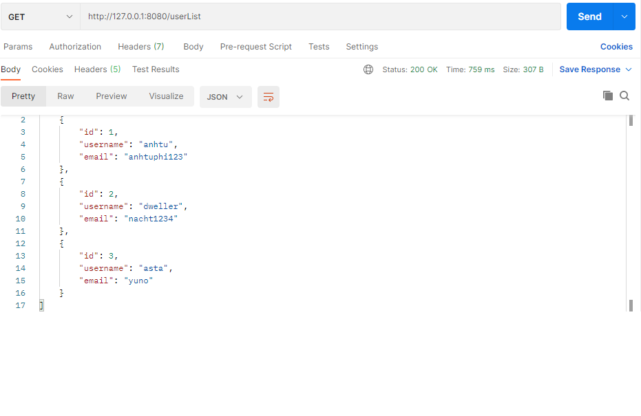
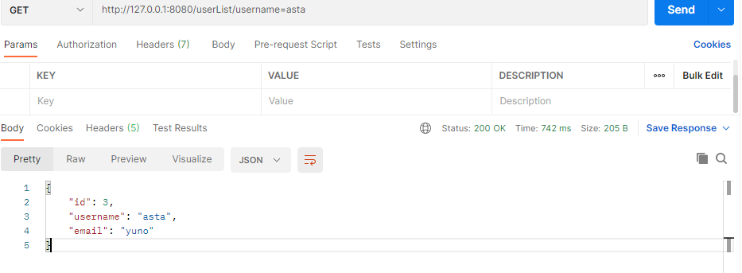

## RESTful API Server ##

&nbsp;
** API Description for Project**

METHOD | PATH | DESCRIPTION 
------------|-----|------------
GET | /userList | get list all user
GET | /userList/{id} | get user by param id
GET | /userList/username={username} | get user by param username
GET | /userList/email={email} | get user by param email
POST | /create | create new user 
DELETE | /userList/{id} | delete user by id
PUT | /updateUser/{id} | update user by id

** EXAMPLE**

